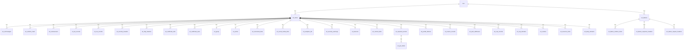

# Database Schema

`domain_status` stores scan results in a single SQLite database, defaulting to `./domain_status.db`.

The schema is created by migrations (`migrations/0001_initial_schema.sql` through `migrations/0008_jwt_claims.sql`) and follows a simple pattern:

- `runs` stores run-level metadata
- `url_status` stores one successful observation row per URL result
- `url_failures` stores failed URL attempts
- most other tables are satellite tables hanging off `url_status` or `url_failures`

## High-Level Shape


```mermaid
erDiagram
    runs ||--o{ url_status : has
    runs ||--o{ url_failures : has

    url_status ||--o{ url_technologies : has
    url_status ||--o{ url_redirect_chain : has
    url_status ||--o{ url_nameservers : has
    url_status ||--o{ url_txt_records : has
    url_status ||--o{ url_mx_records : has
    url_status ||--o{ url_security_headers : has
    url_status ||--o{ url_http_headers : has
    url_status ||--o{ url_certificate_oids : has
    url_status ||--o{ url_certificate_sans : has
    url_status ||--o| url_geoip : has
    url_status ||--o| url_whois : has
    url_status ||--o{ url_structured_data : has
    url_status ||--o{ url_social_media_links : has
    url_status ||--o{ url_analytics_ids : has
    url_status ||--o{ url_security_warnings : has
    url_status ||--o| url_favicons : has
    url_status ||--o{ url_contact_links : has
    url_status ||--o{ url_exposed_secrets : has
    url_status ||--o{ url_partial_failures : has
    url_status ||--o{ url_cname_records : has
    url_status ||--o{ url_ipv6_addresses : has
    url_status ||--o{ url_caa_records : has
    url_status ||--o{ url_csp_domains : has
    url_status ||--o{ url_cookies : has
    url_status ||--o{ url_resource_hints : has
    url_status ||--o{ url_body_domains : has

    url_exposed_secrets ||--o| url_jwt_claims : has

    url_failures ||--o{ url_failure_redirect_chain : has
    url_failures ||--o{ url_failure_response_headers : has
    url_failures ||--o{ url_failure_request_headers : has
```

## Core Tables

### `runs`

One row per scan invocation.

| Column | Type | Notes |
|--------|------|-------|
| `run_id` | `TEXT PRIMARY KEY` | Generated as `run_<epoch_ms>` |
| `version` | `TEXT` | Application version |
| `fingerprints_source` | `TEXT` | Source URL/path used for fingerprint initialization |
| `fingerprints_version` | `TEXT` | Fingerprint ruleset version/commit |
| `geoip_version` | `TEXT` | GeoIP database version when available |
| `start_time_ms` | `INTEGER NOT NULL` | Scan start time |
| `end_time_ms` | `INTEGER` | Nullable until completion |
| `elapsed_seconds` | `REAL` | Populated at finalization |
| `total_urls` | `INTEGER DEFAULT 0` | Total URLs attempted |
| `successful_urls` | `INTEGER DEFAULT 0` | Successful URL observations |
| `failed_urls` | `INTEGER DEFAULT 0` | Failed URL attempts |
| `skipped_urls` | `INTEGER DEFAULT 0` | URLs intentionally skipped (e.g. duplicate domain in same run) |

### `url_status`

The main fact table for successful URL observations.

Important characteristics:

- stores the final observed domain after redirects
- keeps `ip_address` as `TEXT NOT NULL`
- uses `observed_at_ms` for run-time uniqueness
- links back to `runs.run_id`

| Column | Type | Notes |
|--------|------|-------|
| `id` | `INTEGER PRIMARY KEY AUTOINCREMENT` | Surrogate key |
| `initial_domain` | `TEXT NOT NULL` | Domain from the input URL |
| `final_domain` | `TEXT NOT NULL` | Domain after redirects |
| `ip_address` | `TEXT NOT NULL` | Resolved IP address; empty string is possible when no IP was persisted |
| `reverse_dns_name` | `TEXT` | PTR result when available |
| `http_status` | `INTEGER NOT NULL` | HTTP status code |
| `http_status_text` | `TEXT NOT NULL` | Human-readable status |
| `response_time_seconds` | `REAL NOT NULL` | Response time |
| `title` | `TEXT NOT NULL` | Empty string when missing |
| `keywords` | `TEXT` | Optional meta keywords |
| `description` | `TEXT` | Optional meta description |
| `is_mobile_friendly` | `BOOLEAN NOT NULL DEFAULT 0` | Viewport-meta heuristic |
| `tls_version` | `TEXT` | Nullable for HTTP-only or missing TLS data |
| `cipher_suite` | `TEXT` | Captured TLS cipher suite |
| `key_algorithm` | `TEXT` | Parsed certificate key algorithm |
| `ssl_cert_subject` | `TEXT` | Certificate subject |
| `ssl_cert_issuer` | `TEXT` | Certificate issuer |
| `ssl_cert_valid_from_ms` | `INTEGER` | Epoch milliseconds |
| `ssl_cert_valid_to_ms` | `INTEGER` | Epoch milliseconds |
| `spf_record` | `TEXT` | Convenience extraction from TXT records |
| `dmarc_record` | `TEXT` | Convenience extraction from TXT records |
| `body_sha256` | `TEXT` | SHA-256 hash of the response body (content fingerprinting) |
| `content_length` | `INTEGER` | Response body length in bytes |
| `http_version` | `TEXT` | HTTP protocol version (`HTTP/1.1`, `HTTP/2`, etc.) |
| `body_word_count` | `INTEGER` | Word count of the response body |
| `body_line_count` | `INTEGER` | Line count of the response body |
| `content_type` | `TEXT` | Content-Type header value |
| `canonical_url` | `TEXT` | URL from `<link rel="canonical">` |
| `cert_fingerprint_sha256` | `TEXT` | SHA-256 hash of the leaf TLS certificate DER |
| `cert_serial_number` | `TEXT` | Certificate serial number |
| `cert_is_self_signed` | `BOOLEAN` | Whether issuer == subject |
| `cert_is_wildcard` | `BOOLEAN` | Whether any SAN starts with `*.` |
| `cert_is_mismatched` | `BOOLEAN` | Whether cert doesn't match requested domain |
| `meta_refresh_url` | `TEXT` | Client-side redirect from `<meta http-equiv="refresh">` |
| `observed_at_ms` | `INTEGER NOT NULL` | Observation timestamp |
| `run_id` | `TEXT` | FK to `runs.run_id` |

Constraint:

```sql
UNIQUE(final_domain, observed_at_ms)
```

### `url_failures`

Stores failed URL processing attempts.

| Column | Type | Notes |
|--------|------|-------|
| `id` | `INTEGER PRIMARY KEY AUTOINCREMENT` | Surrogate key |
| `attempted_url` | `TEXT NOT NULL` | Original URL attempted |
| `final_url` | `TEXT` | Last URL reached before failing |
| `initial_domain` | `TEXT NOT NULL` | Domain from the original URL |
| `final_domain` | `TEXT` | Domain after redirects if known |
| `error_type` | `TEXT NOT NULL` | Categorized error type |
| `error_message` | `TEXT NOT NULL` | Stored failure message |
| `http_status` | `INTEGER` | Status code when available |
| `retry_count` | `INTEGER NOT NULL DEFAULT 0` | Attempts consumed |
| `elapsed_time_seconds` | `REAL` | Optional elapsed time |
| `observed_at_ms` | `INTEGER NOT NULL` | Failure timestamp |
| `run_id` | `TEXT` | FK to `runs.run_id` |

### `url_partial_failures`

Captures non-fatal enrichment failures associated with otherwise successful `url_status` rows.

| Column | Type | Notes |
|--------|------|-------|
| `url_status_id` | `INTEGER NOT NULL` | FK to `url_status.id` |
| `error_type` | `TEXT NOT NULL` | Supplemental failure type |
| `error_message` | `TEXT NOT NULL` | Failure detail |
| `observed_at_ms` | `INTEGER NOT NULL` | Timestamp |
| `run_id` | `TEXT` | Optional FK to `runs.run_id` |

## Successful-Observation Satellites

### DNS and redirect satellites

| Table | Purpose | Key columns |
|------|---------|-------------|
| `url_redirect_chain` | Ordered redirect history | `sequence_order`, `redirect_url`, `http_status` |
| `url_nameservers` | Expanded nameserver rows | `nameserver` |
| `url_txt_records` | Expanded TXT record rows | `record_type`, `record_value` |
| `url_mx_records` | Expanded MX rows | `priority`, `mail_exchange` |
| `url_cname_records` | CNAME targets (CDN/hosting infrastructure) | `cname_target` |
| `url_ipv6_addresses` | AAAA records (IPv6 dual-stack detection) | `ipv6_address` |
| `url_caa_records` | Certificate Authority Authorization | `flag`, `tag`, `value` |
| `url_csp_domains` | Domains from Content-Security-Policy | `directive`, `fqdn`, `registrable_domain` |
| `url_cookies` | Cookie security attributes | `cookie_name`, `secure`, `http_only`, `same_site`, `domain`, `path` |
| `url_resource_hints` | Preconnect/dns-prefetch hints | `hint_type`, `href` |
| `url_body_domains` | FQDNs referenced in HTML body | `fqdn`, `registrable_domain` |

### HTTP and TLS satellites

| Table | Purpose | Key columns |
|------|---------|-------------|
| `url_http_headers` | Captured HTTP response headers | `header_name`, `header_value` |
| `url_security_headers` | Security-focused header subset | `header_name`, `header_value` |
| `url_certificate_oids` | Certificate OIDs | `oid` |
| `url_certificate_sans` | Certificate SANs | `san_value` |
| `url_favicons` | Favicon URL/hash/base64 payload | `favicon_url`, `hash`, `base64_data` |

### Enrichment satellites

| Table | Purpose | Key columns |
|------|---------|-------------|
| `url_geoip` | GeoIP/ASN enrichment | `country_code`, `country_name`, `region`, `city`, `latitude`, `longitude`, `postal_code`, `timezone`, `asn`, `asn_org` |
| `url_whois` | WHOIS/RDAP enrichment | `creation_date_ms`, `expiration_date_ms`, `updated_date_ms`, `registrar`, `registrant_country`, `registrant_org`, `whois_statuses`, `nameservers_json`, `raw_response` |
| `url_structured_data` | JSON-LD, Open Graph, Twitter, schema-derived properties | `data_type`, `property_name`, `property_value` |
| `url_social_media_links` | Social profile links | `platform`, `profile_url`, `identifier` |
| `url_analytics_ids` | Analytics/tracking IDs | `provider`, `tracking_id` |
| `url_contact_links` | `mailto:` and `tel:` links | `contact_type`, `contact_value`, `raw_href` |
| `url_security_warnings` | Derived security findings | `warning_code`, `warning_description` |
| `url_technologies` | Technology fingerprint matches | `technology_name`, `technology_version`, `technology_category` |
| `url_exposed_secrets` | Gitleaks-style secret findings in page content | `secret_type`, `matched_value`, `severity`, `location`, `context` |
| `url_jwt_claims` | Decoded JWT header + payload (1:1 with `url_exposed_secrets`) | `header_json`, `payload_json`, `algorithm`, `issuer`, `subject`, `expiration_ms` |

## Failure Satellites

These tables hang off `url_failures.id`:

| Table | Purpose |
|------|---------|
| `url_failure_redirect_chain` | Redirect history captured before failure |
| `url_failure_response_headers` | Response headers observed before failure |
| `url_failure_request_headers` | Request headers sent for debugging |

## Relationship Semantics

- Most `url_status` satellites use `FOREIGN KEY ... ON DELETE CASCADE`.
- `url_status.run_id` and `url_failures.run_id` reference `runs(run_id)`.
- `url_whois` and `url_geoip` are one-to-one enrichments per successful observation.
- `url_jwt_claims` is a one-to-one enrichment per `url_exposed_secrets` row (only populated for `jwt`/`jwt-base64` secret types).
- `UNIQUE(run_id, final_domain)` ensures at most one `url_status` row per domain per run.
- Several multi-valued concepts are normalized into child tables rather than stored inline.

## Schema Notes That Commonly Matter

### WHOIS naming

The current `url_whois` schema uses:

- `registrant_org`
- `whois_statuses`
- `nameservers_json`
- `raw_response`

These names replace older or more ambiguous variants that may appear in stale docs or old queries.

### Secret findings

`url_exposed_secrets.secret_type` stores the rule identifier used by the scanner, while:

- `matched_value` stores the matched secret text
- `severity` stores the classifier severity
- `location` stores where it was found, such as `inline_script` or `html_comment`
- `context` stores nearby source text for analyst review

Uniqueness is enforced by:

```sql
UNIQUE(url_status_id, secret_type, matched_value)
```

## Query Examples

Recent runs:

```sql
SELECT run_id, version, start_time_ms, end_time_ms, total_urls, successful_urls, failed_urls
FROM runs
ORDER BY start_time_ms DESC
LIMIT 20;
```

Successful observations for a run:

```sql
SELECT final_domain, http_status, title, observed_at_ms
FROM url_status
WHERE run_id = 'run_1700000000000'
ORDER BY observed_at_ms DESC;
```

WHOIS enrichment with the current column names:

```sql
SELECT s.final_domain, w.registrar, w.registrant_country, w.registrant_org, w.whois_statuses
FROM url_status AS s
JOIN url_whois AS w ON w.url_status_id = s.id
WHERE s.run_id = 'run_1700000000000';
```

Secret findings by type:

```sql
SELECT secret_type, severity, COUNT(*) AS findings
FROM url_exposed_secrets
GROUP BY secret_type, severity
ORDER BY findings DESC, secret_type;
```

Decoded JWT claims for exposed tokens:

```sql
SELECT es.secret_type, jc.algorithm, jc.issuer, jc.subject,
       datetime(jc.expiration_ms/1000, 'unixepoch') AS expires
FROM url_jwt_claims jc
JOIN url_exposed_secrets es ON es.id = jc.exposed_secret_id
JOIN url_status s ON s.id = es.url_status_id
ORDER BY jc.expiration_ms DESC;
```

## Operational Notes

- Scans write into the default database unless `--db-path` is supplied.
- Exports read from that same database path by default.
- The application enables WAL mode and foreign keys during pool initialization.
- For the source of truth, prefer the migration file over old ad-hoc SQL snippets.
