## 📊 Database Schema

### Entity-Relationship Diagram

```mermaid
erDiagram
    runs ||--o{ url_status : "has"
    url_status ||--o| url_geoip : "has"
    url_status ||--o| url_whois : "has"
    url_status ||--o{ url_technologies : "has"
    url_status ||--o{ url_nameservers : "has"
    url_status ||--o{ url_txt_records : "has"
    url_status ||--o{ url_mx_records : "has"
    url_status ||--o{ url_security_headers : "has"
    url_status ||--o{ url_http_headers : "has"
    url_status ||--o{ url_oids : "has"
    url_status ||--o{ url_redirect_chain : "has"
    url_status ||--o{ url_social_media_links : "has"
    url_status ||--o{ url_structured_data : "has"
    url_status ||--o{ url_security_warnings : "has"
    url_status ||--o{ url_certificate_sans : "has"
    url_status ||--o{ url_analytics_ids : "has"
    url_status ||--o| url_favicons : "has"
    url_status ||--o{ url_partial_failures : "has"

    runs {
        TEXT run_id PK
        TEXT fingerprints_source
        TEXT fingerprints_version
        INTEGER start_time
        INTEGER end_time
        INTEGER total_urls
        INTEGER successful_urls
        INTEGER failed_urls
    }

    url_status {
        INTEGER id PK
        TEXT domain
        TEXT final_domain
        TEXT ip_address
        TEXT reverse_dns_name
        INTEGER status
        TEXT status_description
        NUMERIC response_time
        TEXT title
        TEXT keywords
        TEXT description
        TEXT tls_version
        TEXT ssl_cert_subject
        TEXT ssl_cert_issuer
        INTEGER ssl_cert_valid_from
        INTEGER ssl_cert_valid_to
        BOOLEAN is_mobile_friendly
        INTEGER timestamp
        TEXT spf_record
        TEXT dmarc_record
        TEXT cipher_suite
        TEXT key_algorithm
        TEXT run_id FK
    }

    url_technologies {
        INTEGER id PK
        INTEGER url_status_id FK
        TEXT technology_name
        TEXT technology_category
    }

    url_nameservers {
        INTEGER id PK
        INTEGER url_status_id FK
        TEXT nameserver
    }

    url_txt_records {
        INTEGER id PK
        INTEGER url_status_id FK
        TEXT txt_record
        TEXT record_type
    }

    url_mx_records {
        INTEGER id PK
        INTEGER url_status_id FK
        INTEGER priority
        TEXT mail_exchange
    }

    url_security_headers {
        INTEGER id PK
        INTEGER url_status_id FK
        TEXT header_name
        TEXT header_value
    }

    url_http_headers {
        INTEGER id PK
        INTEGER url_status_id FK
        TEXT header_name
        TEXT header_value
    }

    url_oids {
        INTEGER id PK
        INTEGER url_status_id FK
        TEXT oid
    }

    url_redirect_chain {
        INTEGER id PK
        INTEGER url_status_id FK
        INTEGER sequence_order
        TEXT url
    }

    url_social_media_links {
        INTEGER id PK
        INTEGER url_status_id FK
        TEXT platform
        TEXT url
        TEXT identifier
    }

    url_geoip {
        INTEGER id PK
        INTEGER url_status_id FK
        TEXT ip_address
        TEXT country_code
        TEXT country_name
        TEXT region
        TEXT city
        REAL latitude
        REAL longitude
        TEXT postal_code
        TEXT timezone
        INTEGER asn
        TEXT asn_org
    }

    url_structured_data {
        INTEGER id PK
        INTEGER url_status_id FK
        TEXT data_type
        TEXT property_name
        TEXT property_value
    }

    url_security_warnings {
        INTEGER id PK
        INTEGER url_status_id FK
        TEXT warning_code
        TEXT warning_description
    }

    url_whois {
        INTEGER id PK
        INTEGER url_status_id FK
        INTEGER creation_date
        INTEGER expiration_date
        INTEGER updated_date
        TEXT registrar
        TEXT registrant_country
        TEXT registrant_org
        TEXT status
        TEXT nameservers
        TEXT raw_text
    }

    url_failures ||--o{ url_failure_redirect_chain : "has"
    url_failures ||--o{ url_failure_response_headers : "has"
    url_failures ||--o{ url_failure_request_headers : "has"
    runs ||--o{ url_failures : "has"

    url_failures {
        INTEGER id PK
        TEXT run_id FK
        TEXT url
        TEXT final_url
        TEXT domain
        TEXT final_domain
        TEXT error_type
        TEXT error_message
        INTEGER http_status
        INTEGER retry_count
        NUMERIC elapsed_time_seconds
        INTEGER timestamp
    }

    url_failure_redirect_chain {
        INTEGER id PK
        INTEGER url_failure_id FK
        INTEGER redirect_order
        TEXT redirect_url
    }

    url_failure_response_headers {
        INTEGER id PK
        INTEGER url_failure_id FK
        TEXT header_name
        TEXT header_value
    }

    url_failure_request_headers {
        INTEGER id PK
        INTEGER url_failure_id FK
        TEXT header_name
        TEXT header_value
    }

    url_favicons {
        INTEGER id PK
        INTEGER url_status_id FK
        TEXT favicon_url
        INTEGER hash
        TEXT base64_data
    }

    url_partial_failures {
        INTEGER id PK
        INTEGER url_status_id FK
        TEXT error_type
        TEXT error_message
        INTEGER timestamp
        TEXT run_id FK
    }
```



### Table Descriptions

#### `runs` (Dimension Table)
Stores run-level metadata that applies to an entire execution, not individual URLs.

| Column | Type | Description |
|--------|------|-------------|
| `run_id` | TEXT (PK) | Unique identifier for the run (format: `run_<timestamp_millis>`) |
| `fingerprints_source` | TEXT | Source URL or path of the technology fingerprint ruleset used |
| `fingerprints_version` | TEXT | Version identifier (commit SHA) of the fingerprint ruleset |
| `start_time` | INTEGER | Run start time (milliseconds since Unix epoch) |
| `end_time` | INTEGER | Run end time (milliseconds since Unix epoch, NULL if in progress) |
| `total_urls` | INTEGER | Total number of URLs attempted in this run |
| `successful_urls` | INTEGER | Number of URLs successfully processed |
| `failed_urls` | INTEGER | Number of URLs that failed (timeouts, errors, etc.) |

**Indexes:**
- `idx_runs_start_time` on `start_time` (for chronological queries)

#### `url_status` (Fact Table)
Main table storing atomic, single-valued fields for each URL check. This is the central fact table in the star schema.

| Column | Type | Description |
|--------|------|-------------|
| `id` | INTEGER (PK) | Primary key, auto-increment |
| `domain` | TEXT | Initial domain extracted from the original URL |
| `final_domain` | TEXT | Final domain after following all redirects |
| `ip_address` | TEXT | IP address resolved via DNS |
| `reverse_dns_name` | TEXT | Reverse DNS (PTR) record for the IP address |
| `status` | INTEGER | HTTP status code (e.g., 200, 301, 404) |
| `status_description` | TEXT | Human-readable HTTP status description |
| `response_time` | NUMERIC(10,2) | Time taken to get the response in seconds |
| `title` | TEXT | HTML `<title>` tag content |
| `keywords` | TEXT | Meta keywords from `<meta name="keywords">` |
| `description` | TEXT | Meta description from `<meta name="description">` |
| `tls_version` | TEXT | TLS version used (e.g., TLSv1.3) - NULL for HTTP |
| `ssl_cert_subject` | TEXT | SSL certificate subject (CN, O, etc.) - NULL for HTTP |
| `ssl_cert_issuer` | TEXT | SSL certificate issuer - NULL for HTTP |
| `ssl_cert_valid_from` | INTEGER | Certificate validity start (milliseconds since epoch) |
| `ssl_cert_valid_to` | INTEGER | Certificate validity end (milliseconds since epoch) |
| `is_mobile_friendly` | BOOLEAN | Mobile-friendliness (viewport meta tag present) |
| `timestamp` | INTEGER | Unix timestamp (milliseconds) when data was captured |
| `spf_record` | TEXT | Extracted SPF record from TXT records |
| `dmarc_record` | TEXT | Extracted DMARC record from TXT records |
| `cipher_suite` | TEXT | Negotiated TLS cipher suite - NULL for HTTP |
| `key_algorithm` | TEXT | Certificate public key algorithm (RSA, ECDSA, etc.) - NULL for HTTP |
| `run_id` | TEXT (FK) | Foreign key to `runs.run_id` for time-series tracking |

**Constraints:**
- `UNIQUE (final_domain, timestamp)` - Enables UPSERT semantics
- Foreign key to `runs.run_id`

**Indexes:**
- `idx_url_status_domain` on `domain`
- `idx_url_status_final_domain` on `final_domain`
- `idx_url_status_timestamp` on `timestamp`
- `idx_url_status_run_id_timestamp` on `(run_id, timestamp)`

#### `url_technologies` (Junction Table)
Stores detected web technologies (one row per technology per URL).

| Column | Type | Description |
|--------|------|-------------|
| `id` | INTEGER (PK) | Primary key, auto-increment |
| `url_status_id` | INTEGER (FK) | Foreign key to `url_status.id` |
| `technology_name` | TEXT | Name of the detected technology (e.g., "WordPress", "React") |
| `technology_category` | TEXT | Category of the technology (optional) |

**Constraints:**
- `UNIQUE (url_status_id, technology_name)` - Prevents duplicate technologies per URL
- Foreign key with `ON DELETE CASCADE`

**Indexes:**
- `idx_url_technologies_name` on `technology_name` (for queries like "find all sites using WordPress")
- `idx_url_technologies_status_id` on `url_status_id`

#### `url_nameservers` (Junction Table)
Stores DNS nameserver (NS) records (one row per nameserver per URL).

| Column | Type | Description |
|--------|------|-------------|
| `id` | INTEGER (PK) | Primary key, auto-increment |
| `url_status_id` | INTEGER (FK) | Foreign key to `url_status.id` |
| `nameserver` | TEXT | Nameserver hostname (e.g., "ns1.example.com") |

**Constraints:**
- `UNIQUE (url_status_id, nameserver)` - Prevents duplicate nameservers per URL
- Foreign key with `ON DELETE CASCADE`

**Indexes:**
- `idx_url_nameservers_nameserver` on `nameserver`
- `idx_url_nameservers_status_id` on `url_status_id`

#### `url_txt_records` (Junction Table)
Stores DNS TXT records with automatic type detection (one row per TXT record per URL).

| Column | Type | Description |
|--------|------|-------------|
| `id` | INTEGER (PK) | Primary key, auto-increment |
| `url_status_id` | INTEGER (FK) | Foreign key to `url_status.id` |
| `txt_record` | TEXT | Full TXT record content |
| `record_type` | TEXT | Detected type: `SPF`, `DMARC`, `VERIFICATION`, or `OTHER` |

**Constraints:**
- Foreign key with `ON DELETE CASCADE`
- No UNIQUE constraint (multiple identical TXT records are possible)

**Indexes:**
- `idx_url_txt_records_type` on `record_type` (for filtering by type)
- `idx_url_txt_records_status_id` on `url_status_id`

#### `url_mx_records` (Junction Table)
Stores DNS MX (mail exchange) records with priority (one row per MX record per URL).

| Column | Type | Description |
|--------|------|-------------|
| `id` | INTEGER (PK) | Primary key, auto-increment |
| `url_status_id` | INTEGER (FK) | Foreign key to `url_status.id` |
| `priority` | INTEGER | MX record priority (lower = higher priority) |
| `mail_exchange` | TEXT | Mail server hostname (e.g., "mail.example.com") |

**Constraints:**
- `UNIQUE (url_status_id, priority, mail_exchange)` - Prevents duplicate MX records
- Foreign key with `ON DELETE CASCADE`

**Indexes:**
- `idx_url_mx_records_exchange` on `mail_exchange`
- `idx_url_mx_records_status_id` on `url_status_id`

#### `url_security_headers` (Junction Table)
Stores HTTP security headers as key-value pairs (one row per header per URL).

| Column | Type | Description |
|--------|------|-------------|
| `id` | INTEGER (PK) | Primary key, auto-increment |
| `url_status_id` | INTEGER (FK) | Foreign key to `url_status.id` |
| `header_name` | TEXT | Security header name (e.g., "Content-Security-Policy", "Strict-Transport-Security") |
| `header_value` | TEXT | Full header value |

**Headers Captured:**
- `Content-Security-Policy`
- `Strict-Transport-Security`
- `X-Content-Type-Options`
- `X-Frame-Options`
- `X-XSS-Protection`
- `Referrer-Policy`
- `Permissions-Policy`

**Constraints:**
- `UNIQUE (url_status_id, header_name)` - One value per header per URL
- Foreign key with `ON DELETE CASCADE`

**Indexes:**
- `idx_url_security_headers_name` on `header_name` (for queries like "find all sites with HSTS")
- `idx_url_security_headers_status_id` on `url_status_id`

#### `url_http_headers` (Junction Table)
Stores HTTP headers (non-security) as key-value pairs (one row per header per URL).

| Column | Type | Description |
|--------|------|-------------|
| `id` | INTEGER (PK) | Primary key, auto-increment |
| `url_status_id` | INTEGER (FK) | Foreign key to `url_status.id` |
| `header_name` | TEXT | HTTP header name (e.g., "Server", "CF-Ray", "Cache-Control") |
| `header_value` | TEXT | Full header value |

**Headers Captured:**

The headers captured are defined in `src/config.rs` in the `HTTP_HEADERS` array. Currently includes:

- **Infrastructure/Server identification:**
  - `Server` - Web server software and version (e.g., "nginx/1.18.0", "Apache/2.4.41")
  - `X-Powered-By` - Application framework (e.g., "PHP/7.4.3", "ASP.NET")
  - `X-Generator` - CMS or site generator (e.g., "WordPress", "Drupal")

- **CDN/Proxy identification:**
  - `CF-Ray` - Cloudflare request ID
  - `X-Served-By` - Fastly cache server
  - `Via` - Proxy/CDN chain information

- **Performance/Monitoring:**
  - `Server-Timing` - Performance metrics
  - `X-Cache` - Cache hit/miss status

- **Caching:**
  - `Cache-Control` - Cache directives
  - `ETag` - Entity tag for cache validation
  - `Last-Modified` - Resource modification timestamp

**Note:** To add or remove headers, modify the `HTTP_HEADERS` array in `src/config.rs`.

**Constraints:**
- `UNIQUE (url_status_id, header_name)` - One value per header per URL
- Foreign key with `ON DELETE CASCADE`

**Indexes:**
- `idx_url_http_headers_name` on `header_name` (for queries like "find all sites using nginx" or "find all Cloudflare sites")
- `idx_url_http_headers_status_id` on `url_status_id`

**Query Examples:**
```sql
-- Find all sites using nginx
SELECT DISTINCT us.domain FROM url_status us
JOIN url_http_headers uhh ON us.id = uhh.url_status_id
WHERE uhh.header_name = 'Server' AND uhh.header_value LIKE 'nginx%';

-- Find all sites behind Cloudflare
SELECT DISTINCT us.domain FROM url_status us
JOIN url_http_headers uhh ON us.id = uhh.url_status_id
WHERE uhh.header_name = 'CF-Ray';

-- Find sites with aggressive caching
SELECT DISTINCT us.domain, uhh.header_value
FROM url_status us
JOIN url_http_headers uhh ON us.id = uhh.url_status_id
WHERE uhh.header_name = 'Cache-Control'
  AND uhh.header_value LIKE '%max-age=31536000%';
```

#### `url_oids` (Junction Table)
Stores SSL certificate OIDs (Object Identifiers) from the certificate (one row per OID per URL).

| Column | Type | Description |
|--------|------|-------------|
| `id` | INTEGER (PK) | Primary key, auto-increment |
| `url_status_id` | INTEGER (FK) | Foreign key to `url_status.id` |
| `oid` | TEXT | Certificate OID (see below for common OIDs) |

**OIDs Captured:**

1. **Extension OIDs** (identifiers for certificate extensions):
   - `2.5.29.32` - Certificate Policies
   - `2.5.29.37` - Extended Key Usage
   - `2.5.29.15` - Key Usage
   - `2.5.29.17` - Subject Alternative Name
   - `2.5.29.35` - Authority Key Identifier
   - `2.5.29.14` - Subject Key Identifier
   - `2.5.29.19` - Basic Constraints
   - `2.5.29.31` - CRL Distribution Points

2. **Certificate Policy OIDs** (validation levels):
   - `2.23.140.1.1` - Extended Validation (EV) Certificate
   - `2.23.140.1.2.1` - Domain Validated (DV) Certificate
   - `2.23.140.1.2.2` - Organization Validated (OV) Certificate
   - `2.23.140.1.2.3` - Individual Validated (IV) Certificate

3. **Extended Key Usage OIDs** (key purposes):
   - `1.3.6.1.5.5.7.3.1` - Server Authentication
   - `1.3.6.1.5.5.7.3.2` - Client Authentication
   - `1.3.6.1.5.5.7.3.3` - Code Signing
   - `1.3.6.1.5.5.7.3.4` - Email Protection
   - `1.3.6.1.5.5.7.3.8` - Time Stamping
   - `1.3.6.1.5.5.7.3.9` - OCSP Signing

4. **CA-Specific OIDs** (proprietary policy OIDs from certificate authorities)

**Constraints:**
- `UNIQUE (url_status_id, oid)` - Prevents duplicate OIDs per URL
- Foreign key with `ON DELETE CASCADE`

**Indexes:**
- `idx_url_oids_oid` on `oid` (for queries like "find all EV certificates" or "find all certificates with server auth")
- `idx_url_oids_status_id` on `url_status_id`

**Query Examples:**
```sql
-- Find all EV certificates
SELECT DISTINCT us.domain FROM url_status us
JOIN url_oids uo ON us.id = uo.url_status_id
WHERE uo.oid = '2.23.140.1.1';

-- Find all certificates with server authentication
SELECT DISTINCT us.domain FROM url_status us
JOIN url_oids uo ON us.id = uo.url_status_id
WHERE uo.oid = '1.3.6.1.5.5.7.3.1';

-- Find certificates with Extended Key Usage extension
SELECT DISTINCT us.domain FROM url_status us
JOIN url_oids uo ON us.id = uo.url_status_id
WHERE uo.oid = '2.5.29.37';
```

#### `url_redirect_chain` (Junction Table)
Stores redirect chain URLs in sequence order (one row per URL in the chain).

| Column | Type | Description |
|--------|------|-------------|
| `id` | INTEGER (PK) | Primary key, auto-increment |
| `url_status_id` | INTEGER (FK) | Foreign key to `url_status.id` |
| `sequence_order` | INTEGER | Order of the URL in the redirect chain (1 = first, 2 = second, etc.) |
| `url` | TEXT | Full URL at this step in the redirect chain |

**Constraints:**
- `UNIQUE (url_status_id, sequence_order)` - Ensures one URL per position
- Foreign key with `ON DELETE CASCADE`

**Indexes:**
- `idx_url_redirect_chain_status_id` on `url_status_id`

**Notes:**
- Sequence order is preserved to maintain the redirect flow
- First URL in chain has `sequence_order = 1`
- Final URL (after all redirects) is stored in `url_status.final_domain`

#### `url_geoip` (Junction Table)
Stores geographic and network information for IP addresses (one-to-one relationship with `url_status`).

| Column | Type | Description |
|--------|------|-------------|
| `id` | INTEGER (PK) | Primary key, auto-increment |
| `url_status_id` | INTEGER (FK) | Foreign key to `url_status.id` (one-to-one) |
| `ip_address` | TEXT | IP address (denormalized from `url_status` for query convenience) |
| `country_code` | TEXT | ISO 3166-1 alpha-2 country code (e.g., "US", "GB") |
| `country_name` | TEXT | Full country name (e.g., "United States", "United Kingdom") |
| `region` | TEXT | State/province/region name (e.g., "California", "England") |
| `city` | TEXT | City name (e.g., "San Francisco", "London") |
| `latitude` | REAL | Latitude coordinate |
| `longitude` | REAL | Longitude coordinate |
| `postal_code` | TEXT | Postal/ZIP code |
| `timezone` | TEXT | Timezone (e.g., "America/Los_Angeles", "Europe/London") |
| `asn` | INTEGER | Autonomous System Number (if available from ASN database) |
| `asn_org` | TEXT | ASN organization name (e.g., "AS15169 Google LLC", "AS16509 AMAZON-02") |

**Constraints:**
- `UNIQUE (url_status_id)` - One-to-one relationship with `url_status`
- Foreign key with `ON DELETE CASCADE`

**Indexes:**
- `idx_url_geoip_country_code` on `country_code` (for geographic queries)
- `idx_url_geoip_city` on `city`
- `idx_url_geoip_asn` on `asn` (for network analysis)
- `idx_url_geoip_url_status_id` on `url_status_id`

**Notes:**
- GeoIP data requires MaxMind GeoLite2 databases (City and ASN)
- Databases are automatically downloaded and cached if `MAXMIND_LICENSE_KEY` environment variable is set
- Cache TTL: 7 days (databases are updated weekly)
- If GeoIP is disabled or lookup fails, this table will have no rows for those URLs
- IP address is stored in both `url_status` and `url_geoip` (denormalized for query performance)

**Query Examples:**
```sql
-- Find all sites hosted in the United States
SELECT DISTINCT us.domain, g.city, g.region
FROM url_status us
JOIN url_geoip g ON us.id = g.url_status_id
WHERE g.country_code = 'US';

-- Find all sites hosted on AWS (ASN 16509)
SELECT DISTINCT us.domain, g.asn_org
FROM url_status us
JOIN url_geoip g ON us.id = g.url_status_id
WHERE g.asn = 16509;

-- Geographic distribution of sites
SELECT g.country_code, g.country_name, COUNT(*) as site_count
FROM url_geoip g
GROUP BY g.country_code, g.country_name
ORDER BY site_count DESC;
```

#### `url_social_media_links` (Junction Table)
Stores social media platform links extracted from HTML (one row per link per URL).

| Column | Type | Description |
|--------|------|-------------|
| `id` | INTEGER (PK) | Primary key, auto-increment |
| `url_status_id` | INTEGER (FK) | Foreign key to `url_status.id` |
| `platform` | TEXT | Social media platform name (e.g., "LinkedIn", "Twitter", "Facebook", "Instagram", "YouTube", "GitHub", "TikTok", "Pinterest", "Snapchat", "Reddit") |
| `url` | TEXT | Full URL to the social media profile/page |
| `identifier` | TEXT | Username, handle, or ID extracted from URL (e.g., company slug, username) |

**Platforms Supported:**
- **LinkedIn**: Company pages (`/company/{slug}`), profiles (`/in/{slug}`), publisher pages (`/pub/{slug}`)
- **Twitter/X**: User profiles (`twitter.com/{handle}` or `x.com/{handle}`)
- **Facebook**: Pages and profiles (`facebook.com/{page}`)
- **Instagram**: User profiles (`instagram.com/{username}`)
- **YouTube**: Channels (`/channel/{id}`), users (`/user/{name}`), custom URLs (`/c/{name}`)
- **GitHub**: User/organization profiles (`github.com/{username}`)
- **TikTok**: User profiles (`tiktok.com/@{username}`)
- **Pinterest**: User/board pages (`pinterest.com/{username}`)
- **Snapchat**: User profiles (`snapchat.com/add/{username}`)
- **Reddit**: Subreddits (`/r/{name}`) and users (`/u/{name}`)

**Constraints:**
- `UNIQUE (url_status_id, platform, url)` - Prevents duplicate links per URL
- Foreign key with `ON DELETE CASCADE`

**Indexes:**
- `idx_url_social_media_links_platform` on `platform` (for queries like "find all sites with LinkedIn links")
- `idx_url_social_media_links_status_id` on `url_status_id`
- `idx_url_social_media_links_identifier` on `identifier` (for finding specific usernames/handles)

**Query Examples:**
```sql
-- Find all sites with LinkedIn company pages
SELECT DISTINCT us.domain, sml.url, sml.identifier
FROM url_status us
JOIN url_social_media_links sml ON us.id = sml.url_status_id
WHERE sml.platform = 'LinkedIn' AND sml.url LIKE '%/company/%';

-- Find all sites with Twitter/X links
SELECT DISTINCT us.domain, sml.url, sml.identifier
FROM url_status us
JOIN url_social_media_links sml ON us.id = sml.url_status_id
WHERE sml.platform = 'Twitter';

-- Count social media platforms per site
SELECT us.domain, COUNT(DISTINCT sml.platform) as platform_count
FROM url_status us
LEFT JOIN url_social_media_links sml ON us.id = sml.url_status_id
GROUP BY us.domain
ORDER BY platform_count DESC;
```

#### `url_structured_data` (Junction Table)
Stores structured data extracted from HTML (JSON-LD, Open Graph, Twitter Cards, Schema.org types).

| Column | Type | Description |
|--------|------|-------------|
| `id` | INTEGER (PK) | Primary key, auto-increment |
| `url_status_id` | INTEGER (FK) | Foreign key to `url_status.id` |
| `data_type` | TEXT | Type of structured data: `json_ld`, `open_graph`, `twitter_card`, or `schema_type` |
| `property_name` | TEXT | Property name (e.g., `og:title`, `twitter:card`, Schema.org `@type`). Empty for JSON-LD (full JSON in `property_value`) |
| `property_value` | TEXT | Property value (Open Graph/Twitter content, full JSON-LD object as string, or empty for Schema types) |

**Constraints:**
- Foreign key with `ON DELETE CASCADE`
- No UNIQUE constraint (multiple properties per type are allowed)

**Indexes:**
- `idx_url_structured_data_type` on `data_type`
- `idx_url_structured_data_property` on `property_name`
- `idx_url_structured_data_status_id` on `url_status_id`
- `idx_url_structured_data_type_property` on `(data_type, property_name)` (composite index)

**Query Examples:**
```sql
-- Find all sites with Open Graph titles
SELECT DISTINCT us.domain, usd.property_value
FROM url_status us
JOIN url_structured_data usd ON us.id = usd.url_status_id
WHERE usd.data_type = 'open_graph' AND usd.property_name = 'og:title';

-- Find all sites with JSON-LD structured data
SELECT DISTINCT us.domain
FROM url_status us
JOIN url_structured_data usd ON us.id = usd.url_status_id
WHERE usd.data_type = 'json_ld';
```

#### `url_security_warnings` (Junction Table)
Stores security analysis warnings for each URL (one row per warning per URL).

| Column | Type | Description |
|--------|------|-------------|
| `id` | INTEGER (PK) | Primary key, auto-increment |
| `url_status_id` | INTEGER (FK) | Foreign key to `url_status.id` |
| `warning_code` | TEXT | Warning code identifier (e.g., `MISSING_HSTS`, `WEAK_CIPHER`) |
| `warning_description` | TEXT | Human-readable warning description |

**Constraints:**
- `UNIQUE (url_status_id, warning_code)` - One warning per code per URL
- Foreign key with `ON DELETE CASCADE`

**Indexes:**
- `idx_url_security_warnings_code` on `warning_code` (for queries like "find all sites with missing HSTS")
- `idx_url_security_warnings_status_id` on `url_status_id`

**Query Examples:**
```sql
-- Find all sites with security warnings
SELECT DISTINCT us.domain, usw.warning_code, usw.warning_description
FROM url_status us
JOIN url_security_warnings usw ON us.id = usw.url_status_id;

-- Count warnings by type
SELECT warning_code, COUNT(*) as count
FROM url_security_warnings
GROUP BY warning_code
ORDER BY count DESC;
```

#### `url_whois` (One-to-One Table)
Stores domain registration information from WHOIS/RDAP lookups (one-to-one relationship with `url_status`).

| Column | Type | Description |
|--------|------|-------------|
| `id` | INTEGER (PK) | Primary key, auto-increment |
| `url_status_id` | INTEGER (FK) | Foreign key to `url_status.id` (one-to-one) |
| `creation_date` | INTEGER | Domain creation date (milliseconds since Unix epoch) |
| `expiration_date` | INTEGER | Domain expiration date (milliseconds since Unix epoch) |
| `updated_date` | INTEGER | Domain last updated date (milliseconds since Unix epoch) |
| `registrar` | TEXT | Registrar name (e.g., "GoDaddy", "Namecheap") |
| `registrant_country` | TEXT | ISO 3166-1 alpha-2 country code (e.g., "US", "GB") |
| `registrant_org` | TEXT | Registrant organization name |
| `status` | TEXT | Domain status codes (JSON array, e.g., `["clientTransferProhibited"]`) |
| `nameservers` | TEXT | Nameservers from WHOIS (JSON array) |
| `raw_text` | TEXT | Raw WHOIS text (for debugging/fallback) |

**Constraints:**
- `UNIQUE (url_status_id)` - One-to-one relationship with `url_status`
- Foreign key with `ON DELETE CASCADE`

**Indexes:**
- `idx_url_whois_registrar` on `registrar` (for queries like "find all domains registered with GoDaddy")
- `idx_url_whois_country` on `registrant_country` (for geographic analysis)
- `idx_url_whois_status_id` on `url_status_id`

**Notes:**
- WHOIS lookup requires `--enable-whois` flag to be enabled
- WHOIS queries are rate-limited to 1 query per 2 seconds (0.5 queries/second)
- WHOIS data is cached for 7 days in `.whois_cache/` directory
- If WHOIS is disabled or lookup fails, this table will have no rows for those URLs

#### `url_failures` (Fact Table)
Stores detailed information about URL processing failures. This table is separate from `url_status` because failures represent "bad data" (errors) rather than successful processing results. This allows for analysis of failure patterns to improve the tool.

| Column | Type | Description |
|--------|------|-------------|
| `id` | INTEGER (PK) | Primary key, auto-increment |
| `run_id` | TEXT (FK) | Foreign key to `runs.run_id` |
| `url` | TEXT | Original URL that failed |
| `final_url` | TEXT | Final URL after redirects (if any redirects occurred before failure) |
| `domain` | TEXT | Initial domain extracted from original URL |
| `final_domain` | TEXT | Final domain after redirects (if any) |
| `error_type` | TEXT | Categorized error type (e.g., "Not Found (404)", "Bot detection (403 Forbidden)", "Process URL timeout") |
| `error_message` | TEXT | Full error message for debugging |
| `http_status` | INTEGER | HTTP status code if available (e.g., 403, 404, 500, 503) |
| `retry_count` | INTEGER | Number of retry attempts made before giving up |
| `elapsed_time_seconds` | NUMERIC(10,2) | Time spent processing before failure |
| `timestamp` | INTEGER | When the failure occurred (milliseconds since Unix epoch) |

**Indexes:**
- `idx_url_failures_domain` on `domain`
- `idx_url_failures_final_domain` on `final_domain`
- `idx_url_failures_error_type` on `error_type`
- `idx_url_failures_http_status` on `http_status`
- `idx_url_failures_timestamp` on `timestamp`
- `idx_url_failures_run_id_timestamp` on `run_id, timestamp`
- `idx_url_failures_url` on `url`

**Notes:**
- Failures are recorded for all errors: HTTP errors (4xx/5xx), timeouts, connection errors, DNS errors, TLS errors, etc.
- Response headers are only captured for HTTP error responses (4xx/5xx). For connection errors, timeouts, etc., there is no HTTP response, so `url_failure_response_headers` will be empty for those failures.
- Request headers are always captured (they show what we sent, useful for debugging bot detection).

#### `url_failure_redirect_chain` (Junction Table)
Stores the redirect chain that occurred before a failure. Useful for understanding bot detection patterns (e.g., redirects to a challenge page before 403).

| Column | Type | Description |
|--------|------|-------------|
| `id` | INTEGER (PK) | Primary key, auto-increment |
| `url_failure_id` | INTEGER (FK) | Foreign key to `url_failures.id` |
| `redirect_order` | INTEGER | Order in the redirect chain (0 = first redirect) |
| `redirect_url` | TEXT | URL redirected to at this step |

**Indexes:**
- `idx_url_failure_redirect_chain_failure_id` on `url_failure_id`

#### `url_failure_response_headers` (Junction Table)
Stores HTTP response headers received before a failure. Only populated for HTTP error responses (4xx/5xx). Empty for connection errors, timeouts, DNS errors, etc. (no HTTP response received).

| Column | Type | Description |
|--------|------|-------------|
| `id` | INTEGER (PK) | Primary key, auto-increment |
| `url_failure_id` | INTEGER (FK) | Foreign key to `url_failures.id` |
| `header_name` | TEXT | HTTP header name (e.g., "Server", "X-RateLimit-Remaining") |
| `header_value` | TEXT | HTTP header value |

**Indexes:**
- `idx_url_failure_response_headers_failure_id` on `url_failure_id`

**Notes:**
- Only populated when an HTTP response was received (even if it's an error status like 403, 404, 500)
- Empty for connection errors, timeouts, DNS failures, etc. (no HTTP response = no headers)
- Useful for analyzing bot detection patterns (e.g., Cloudflare challenge headers, rate limit headers)

#### `url_failure_request_headers` (Junction Table)
Stores HTTP request headers that were sent. Always populated (we always know what we sent). Useful for debugging bot detection (understanding what headers might have triggered blocking).

| Column | Type | Description |
|--------|------|-------------|
| `id` | INTEGER (PK) | Primary key, auto-increment |
| `url_failure_id` | INTEGER (FK) | Foreign key to `url_failures.id` |
| `header_name` | TEXT | HTTP header name (e.g., "Accept", "User-Agent") |
| `header_value` | TEXT | HTTP header value |

**Indexes:**
- `idx_url_failure_request_headers_failure_id` on `url_failure_id`

**Notes:**
- Always populated (we always know what headers we sent)
- Useful for understanding what might have triggered bot detection or rate limiting

#### `url_certificate_sans` (Junction Table)
Stores DNS names from the Subject Alternative Name (SAN) extension of SSL/TLS certificates. SANs enable graph analysis by linking domains that share the same certificate (indicating common ownership or infrastructure).

| Column | Type | Description |
|--------|------|-------------|
| `id` | INTEGER (PK) | Primary key, auto-increment |
| `url_status_id` | INTEGER (FK) | Foreign key to `url_status.id` |
| `domain_name` | TEXT | DNS name from certificate SAN extension (e.g., "www.example.com", "*.example.com") |

**Constraints:**
- `UNIQUE (url_status_id, domain_name)` - Prevents duplicate SAN entries per URL
- Foreign key with `ON DELETE CASCADE`

**Indexes:**
- `idx_url_certificate_sans_domain_name` on `domain_name` (for queries like "find all URLs sharing a certificate with example.com")
- `idx_url_certificate_sans_url_status_id` on `url_status_id`

**Notes:**
- Only DNS names are extracted (IP addresses, email addresses, etc. are ignored)
- Wildcard domains (e.g., `*.example.com`) are stored as-is
- Certificates often have multiple SANs (e.g., a certificate for `example.com` might also cover `www.example.com`, `api.example.com`, etc.)
- If a certificate has no SAN extension, this table will have no rows for that URL

**Query Examples:**
```sql
-- Find all domains sharing a certificate with example.com
SELECT DISTINCT us1.final_domain, us2.final_domain
FROM url_status us1
JOIN url_certificate_sans san1 ON us1.id = san1.url_status_id
JOIN url_certificate_sans san2 ON san1.domain_name = san2.domain_name
JOIN url_status us2 ON san2.url_status_id = us2.id
WHERE us1.final_domain = 'example.com' AND us1.id != us2.id;

-- Count SANs per certificate
SELECT us.final_domain, COUNT(san.id) as san_count
FROM url_status us
LEFT JOIN url_certificate_sans san ON us.id = san.url_status_id
WHERE us.tls_version IS NOT NULL
GROUP BY us.id, us.final_domain
ORDER BY san_count DESC;

-- Find all wildcard SANs
SELECT DISTINCT san.domain_name
FROM url_certificate_sans san
WHERE san.domain_name LIKE '*%';
```

#### `url_analytics_ids` (Junction Table)
Stores analytics and tracking IDs extracted from HTML/JavaScript. These IDs enable graph analysis by linking domains that share the same tracking IDs (indicating common ownership or management).

| Column | Type | Description |
|--------|------|-------------|
| `id` | INTEGER (PK) | Primary key, auto-increment |
| `url_status_id` | INTEGER (FK) | Foreign key to `url_status.id` |
| `provider` | TEXT | Analytics provider (e.g., "Google Analytics", "Google Analytics 4", "Facebook Pixel", "Google Tag Manager", "Google AdSense") |
| `tracking_id` | TEXT | The tracking ID (e.g., "UA-123456-1", "G-XXXXXXXXXX", "1234567890", "GTM-XXXXX", "pub-XXXXXXXXXX") |

**Constraints:**
- `UNIQUE (url_status_id, provider, tracking_id)` - Prevents duplicate entries per URL
- Foreign key with `ON DELETE CASCADE`

**Indexes:**
- `idx_url_analytics_ids_provider` on `provider` (for queries like "find all URLs using Google Analytics")
- `idx_url_analytics_ids_tracking_id` on `tracking_id` (for queries like "find all URLs sharing a tracking ID" - key for graph analysis)
- `idx_url_analytics_ids_url_status_id` on `url_status_id`

**Notes:**
- Analytics IDs are extracted from HTML content and JavaScript code
- Multiple providers per URL are allowed (e.g., a site might use both Google Analytics and Facebook Pixel)
- Tracking IDs are extracted using regex patterns:
  - **Google Analytics (Universal)**: `ga('create', 'UA-XXXXX-Y')`
  - **Google Analytics 4**: `gtag('config', 'G-XXXXXXXXXX')`
  - **Facebook Pixel**: `fbq('init', 'XXXXX')`
  - **Google Tag Manager**: `GTM-XXXXX` in script src or dataLayer
  - **Google AdSense**: `pub-XXXXXXXXXX` (requires at least 10 digits to avoid false positives)
- If no analytics IDs are found, this table will have no rows for that URL

**Query Examples:**
```sql
-- Find all domains sharing a Google Analytics tracking ID
SELECT DISTINCT us1.final_domain, us2.final_domain, analytics.tracking_id
FROM url_status us1
JOIN url_analytics_ids analytics ON us1.id = analytics.url_status_id
JOIN url_analytics_ids analytics2 ON analytics.tracking_id = analytics2.tracking_id
JOIN url_status us2 ON analytics2.url_status_id = us2.id
WHERE analytics.provider = 'Google Analytics' AND us1.id != us2.id;

-- Count analytics providers per site
SELECT us.final_domain, COUNT(DISTINCT analytics.provider) as provider_count
FROM url_status us
LEFT JOIN url_analytics_ids analytics ON us.id = analytics.url_status_id
GROUP BY us.id, us.final_domain
ORDER BY provider_count DESC;

-- Find all sites using Google Analytics 4
SELECT DISTINCT us.final_domain, analytics.tracking_id
FROM url_status us
JOIN url_analytics_ids analytics ON us.id = analytics.url_status_id
WHERE analytics.provider = 'Google Analytics 4';
```

#### `url_favicons` (One-to-One Table)
Stores Shodan-compatible MurmurHash3 favicon hashes and base64-encoded favicon data. Favicon hashes are a high-value signal for threat intelligence: threat actors frequently reuse default favicons across C2 servers, phishing kits, and shadow IT. The hash format matches Shodan's `http.favicon.hash` exactly, enabling direct interoperability with global threat intelligence feeds.

| Column | Type | Description |
|--------|------|-------------|
| `id` | INTEGER (PK) | Primary key, auto-increment |
| `url_status_id` | INTEGER (FK) | Foreign key to `url_status.id` |
| `favicon_url` | TEXT | URL the favicon was fetched from |
| `hash` | INTEGER | MurmurHash3 (32-bit, signed) of the base64-encoded favicon bytes, Shodan-compatible |
| `base64_data` | TEXT | Base64-encoded raw favicon bytes (for visual verification in dashboards) |

**Constraints:**
- `UNIQUE(url_status_id)` - One-to-one relationship with `url_status`
- Foreign key with `ON DELETE CASCADE`

**Indexes:**
- `idx_url_favicons_hash` on `hash` (for queries like "find all domains sharing this favicon hash")

**Notes:**
- Favicons are discovered via a hybrid strategy: first by parsing `<link rel="icon">` / `<link rel="shortcut icon">` from the HTML, then falling back to `{origin}/favicon.ico` if no link tag is found. This mirrors real browser behavior.
- Favicon downloads are capped at 50KB (`MAX_FAVICON_SIZE`) to prevent database bloat and tarpit attacks. Downloads exceeding this limit are aborted.
- The hash is computed by base64-encoding the raw bytes with newlines inserted every 76 characters (plus a trailing newline), then computing MurmurHash3 (32-bit, seed 0) and casting to i32. This exactly matches Shodan's `http.favicon.hash` format.
- Analysts can take a hash from this table and search Shodan directly: `http.favicon.hash:<hash>`.
- If no favicon is found (404, timeout, or no icon link), this table will have no row for that URL.
- Favicon fetching runs concurrently with technology detection and DNS/TLS lookups, so it does not increase per-URL processing time.

**Query Examples:**
```sql
-- Find all domains sharing the same favicon (indicates shared infrastructure or phishing)
SELECT uf.hash, GROUP_CONCAT(DISTINCT us.final_domain) as domains, COUNT(DISTINCT us.id) as count
FROM url_favicons uf
JOIN url_status us ON uf.url_status_id = us.id
GROUP BY uf.hash
HAVING count > 1
ORDER BY count DESC;

-- Look up domains using a known C2/phishing favicon hash
SELECT us.final_domain, us.ip_address, uf.favicon_url
FROM url_favicons uf
JOIN url_status us ON uf.url_status_id = us.id
WHERE uf.hash = -123456789;

-- Count how many scanned domains have favicons
SELECT
    COUNT(*) as total_urls,
    (SELECT COUNT(*) FROM url_favicons) as with_favicon,
    ROUND(100.0 * (SELECT COUNT(*) FROM url_favicons) / COUNT(*), 1) as pct
FROM url_status;

-- Find favicons served from CDNs (favicon_url on a different domain)
SELECT us.final_domain, uf.favicon_url, uf.hash
FROM url_favicons uf
JOIN url_status us ON uf.url_status_id = us.id
WHERE uf.favicon_url NOT LIKE '%' || us.final_domain || '%';
```

#### `url_partial_failures` (Junction Table)
Stores partial failures (DNS/TLS errors that didn't prevent URL processing). These are errors that occurred during supplementary data collection (DNS lookups, TLS certificate retrieval) but didn't prevent the URL from being successfully processed. The URL was processed and stored in `url_status`, but some optional data is missing.

| Column | Type | Description |
|--------|------|-------------|
| `id` | INTEGER (PK) | Primary key, auto-increment |
| `url_status_id` | INTEGER (FK) | Foreign key to `url_status.id` |
| `error_type` | TEXT | Error type (e.g., "DNS NS lookup error", "DNS TXT lookup error", "DNS MX lookup error", "TLS certificate error") |
| `error_message` | TEXT | Full error message for debugging |
| `timestamp` | INTEGER | When the partial failure occurred (milliseconds since Unix epoch) |
| `run_id` | TEXT (FK) | Foreign key to `runs.run_id` |

**Constraints:**
- Foreign key with `ON DELETE CASCADE`
- Multiple partial failures per URL are allowed (e.g., both NS and TXT lookups could fail)

**Indexes:**
- `idx_url_partial_failures_url_status_id` on `url_status_id`
- `idx_url_partial_failures_error_type` on `error_type` (for queries like "find all DNS timeout errors")
- `idx_url_partial_failures_run_id` on `run_id`

**Notes:**
- Partial failures are different from complete failures (`url_failures`):
  - **Complete failures**: The URL processing failed entirely (timeout, connection error, HTTP 4xx/5xx, etc.). No data is stored in `url_status`.
  - **Partial failures**: The URL was successfully processed and stored in `url_status`, but some optional data collection failed (DNS lookups, TLS certificate info).
- "No records found" DNS responses are NOT recorded as partial failures (this is expected behavior).
- Only actual DNS/TLS errors (timeouts, network errors, certificate parsing failures) are recorded.
- Useful for analyzing DNS/TLS reliability patterns and identifying domains with problematic DNS configurations.

**Query Examples:**
```sql
-- Find all URLs with DNS lookup failures
SELECT DISTINCT us.domain, upf.error_type, upf.error_message
FROM url_status us
JOIN url_partial_failures upf ON us.id = upf.url_status_id
WHERE upf.error_type LIKE 'DNS%';

-- Count partial failures by type
SELECT error_type, COUNT(*) as count
FROM url_partial_failures
GROUP BY error_type
ORDER BY count DESC;

-- Find URLs with multiple partial failures
SELECT us.domain, COUNT(*) as failure_count, GROUP_CONCAT(upf.error_type) as error_types
FROM url_status us
JOIN url_partial_failures upf ON us.id = upf.url_status_id
GROUP BY us.id
HAVING failure_count > 1
ORDER BY failure_count DESC;

-- Find URLs that succeeded but had TLS certificate errors
SELECT DISTINCT us.domain, us.final_domain, upf.error_message
FROM url_status us
JOIN url_partial_failures upf ON us.id = upf.url_status_id
WHERE upf.error_type = 'TLS certificate error';
```

**Query Examples:**
```sql
-- Find all domains registered with a specific registrar
SELECT DISTINCT us.domain, uw.registrar, uw.creation_date
FROM url_status us
JOIN url_whois uw ON us.id = uw.url_status_id
WHERE uw.registrar LIKE '%GoDaddy%';

-- Find domains expiring soon (within 30 days)
SELECT DISTINCT us.domain, uw.expiration_date
FROM url_status us
JOIN url_whois uw ON us.id = uw.url_status_id
WHERE uw.expiration_date IS NOT NULL
  AND uw.expiration_date < (strftime('%s', 'now') * 1000 + 30 * 24 * 60 * 60 * 1000);

-- Find domains by registrant country
SELECT uw.registrant_country, COUNT(*) as domain_count
FROM url_whois uw
WHERE uw.registrant_country IS NOT NULL
GROUP BY uw.registrant_country
ORDER BY domain_count DESC;
```

### Analyst-Friendly Views

The database includes pre-built views for common analytical queries:

#### `url_status_enriched`

Joins `url_status` with 1:1 satellites (GeoIP, WHOIS) for convenient querying. Column names are prefixed to avoid collisions:

```sql
-- Example: Find all sites hosted in the US with registrar info
SELECT final_domain, geoip_country_code, geoip_city, whois_registrar
FROM url_status_enriched
WHERE geoip_country_code = 'US';
```

| Column Alias | Source |
|-------------|--------|
| `http_status` | `url_status.status` (avoids collision with WHOIS status) |
| `observed_at_ms` | `url_status.timestamp` |
| `geoip_*` | All columns from `url_geoip`, prefixed |
| `whois_*` | All columns from `url_whois`, prefixed |
| `whois_statuses_json` | `url_whois.status` (renamed to avoid collision) |

#### `url_observations`

Unified timeline of successes and failures for easier analytics:

```sql
-- Example: Get all observations from a run (success + failure)
SELECT outcome, final_domain, http_status, error_type, observed_at_ms
FROM url_observations
WHERE run_id = 'run_123'
ORDER BY observed_at_ms;

-- Example: Count success/failure ratio per run
SELECT run_id, outcome, COUNT(*) as count
FROM url_observations
GROUP BY run_id, outcome;
```

| Column | Description |
|--------|-------------|
| `outcome` | `'success'` or `'failure'` |
| `observation_id` | ID from source table (`url_status.id` or `url_failures.id`) |
| `error_type` | Error type (NULL for successes) |
| `error_message` | Error details (NULL for successes) |

---

### Schema Design Principles

The database uses a **star schema** design pattern:

1. **Fact Table** (`url_status`): Contains atomic, single-valued fields (measures and dimensions)
2. **Dimension Table** (`runs`): Stores run-level metadata
3. **Junction Tables**: Store multi-valued fields in normalized form:
   - `url_technologies` - Technologies detected
   - `url_nameservers` - DNS nameservers
   - `url_txt_records` - DNS TXT records
   - `url_mx_records` - DNS MX records
   - `url_security_headers` - HTTP security headers
   - `url_http_headers` - HTTP headers (non-security: Server, CDN, caching, etc.)
   - `url_oids` - Certificate OIDs
   - `url_redirect_chain` - Redirect chain URLs
   - `url_social_media_links` - Social media platform links
   - `url_structured_data` - Structured data (JSON-LD, Open Graph, Twitter Cards, Schema.org)
   - `url_security_warnings` - Security analysis warnings
   - `url_certificate_sans` - Certificate Subject Alternative Names (SANs) for linking domains sharing certificates
   - `url_analytics_ids` - Analytics/tracking IDs (Google Analytics, Facebook Pixel, GTM, AdSense) for linking domains sharing tracking IDs
4. **One-to-One Tables**: Store single records per URL:
   - `url_geoip` - Geographic and network information (one-to-one with `url_status`)
   - `url_whois` - Domain registration information (one-to-one with `url_status`)
   - `url_favicons` - Favicon hash and base64 data (one-to-one with `url_status`, Shodan-compatible)
5. **Failure Tracking Tables**: Store detailed failure information separately from successful data:
   - `url_failures` - Main failure fact table (one failure record per failed URL)
   - `url_failure_redirect_chain` - Redirect chain before failure
   - `url_failure_response_headers` - HTTP response headers (only for HTTP error responses)
   - `url_failure_request_headers` - HTTP request headers sent (always populated)
   - `url_partial_failures` - Partial failures (DNS/TLS errors that didn't prevent URL processing)

**Benefits:**
- **No Data Duplication**: Each piece of data stored once
- **Efficient Queries**: Indexes on normalized tables enable fast lookups
- **Analytics-Friendly**: Easy to aggregate and join (e.g., "find all sites using WordPress")
- **Time-Series Support**: `run_id` enables comparing data across different runs
- **Scalability**: Normalized structure scales better than JSON columns

**Query Examples:**

```sql
-- Find all sites using WordPress
SELECT DISTINCT us.domain
FROM url_status us
JOIN url_technologies ut ON us.id = ut.url_status_id
WHERE ut.technology_name = 'WordPress';

-- Find all sites with HSTS enabled
SELECT DISTINCT us.domain, ush.header_value
FROM url_status us
JOIN url_security_headers ush ON us.id = ush.url_status_id
WHERE ush.header_name = 'Strict-Transport-Security';

-- Find all sites using nginx
SELECT DISTINCT us.domain, uhh.header_value
FROM url_status us
JOIN url_http_headers uhh ON us.id = uhh.url_status_id
WHERE uhh.header_name = 'Server' AND uhh.header_value LIKE 'nginx%';

-- Get redirect chain for a domain
SELECT urc.sequence_order, urc.url
FROM url_status us
JOIN url_redirect_chain urc ON us.id = urc.url_status_id
WHERE us.final_domain = 'example.com'
ORDER BY urc.sequence_order;

-- Compare technologies between runs
SELECT ut1.technology_name,
       COUNT(DISTINCT us1.id) as run1_count,
       COUNT(DISTINCT us2.id) as run2_count
FROM url_status us1
JOIN url_technologies ut1 ON us1.id = ut1.url_status_id
LEFT JOIN url_status us2 ON us1.final_domain = us2.final_domain
LEFT JOIN url_technologies ut2 ON us2.id = ut2.url_status_id AND ut1.technology_name = ut2.technology_name
WHERE us1.run_id = 'run_123' AND us2.run_id = 'run_456'
GROUP BY ut1.technology_name;

-- Analyze failure patterns by error type
SELECT error_type, COUNT(*) as count,
       AVG(elapsed_time_seconds) as avg_time,
       AVG(retry_count) as avg_retries
FROM url_failures
WHERE run_id = 'run_123'
GROUP BY error_type
ORDER BY count DESC;

-- Find all 403 Forbidden failures with their response headers (bot detection analysis)
SELECT uf.domain, uf.url, uf.final_url,
       ufrh.header_name, ufrh.header_value
FROM url_failures uf
LEFT JOIN url_failure_response_headers ufrh ON uf.id = ufrh.url_failure_id
WHERE uf.error_type = 'Bot detection (403 Forbidden)'
  AND uf.run_id = 'run_123'
ORDER BY uf.domain, ufrh.header_name;

-- Find failures with redirect chains (useful for understanding bot detection flows)
SELECT uf.domain, uf.error_type, uf.http_status,
       GROUP_CONCAT(ufrc.redirect_url, ' -> ') as redirect_chain
FROM url_failures uf
LEFT JOIN url_failure_redirect_chain ufrc ON uf.id = ufrc.url_failure_id
WHERE uf.run_id = 'run_123'
  AND ufrc.redirect_url IS NOT NULL
GROUP BY uf.id
ORDER BY uf.domain;
```

**Notes:**
- TLS/SSL fields (`tls_version`, `cipher_suite`, `key_algorithm`, etc.) are `NULL` for HTTP (non-HTTPS) URLs
- DNS records (NS, TXT, MX) are queried for the final domain after redirects
- SPF and DMARC records are automatically extracted from TXT records; DMARC is also checked at `_dmarc.<domain>`
- Technology fingerprints are detected using community-maintained rulesets (HTTP Archive and Enthec Wappalyzer forks) via pattern matching (headers, cookies, HTML, script URLs) - **does not execute JavaScript**
- Fingerprint rulesets are cached locally in `.fingerprints_cache/` for 7 days to reduce network requests
- **GeoIP lookup**: Requires MaxMind GeoLite2 databases (City and ASN). If `MAXMIND_LICENSE_KEY` environment variable is set, databases are automatically downloaded and cached in `.geoip_cache/` for 7 days. If license key is not set or GeoIP initialization fails, the application continues without GeoIP data (no error).
- **WHOIS lookup**: Requires `--enable-whois` flag. WHOIS data is cached in `.whois_cache/` for 7 days. WHOIS queries are rate-limited to 0.5 queries/second to respect registrar limits.
- The database uses UPSERT semantics: duplicate `(final_domain, timestamp)` pairs update existing records
- Response body size is capped at 2MB to prevent memory exhaustion
- Only HTML content-types are processed (others are skipped)
- Maximum redirect hops: 10 (prevents infinite loops)

**SQLite Configuration:**
- **WAL Mode**: Enabled for better concurrent read/write performance
- **Foreign Keys**: Enabled (`PRAGMA foreign_keys=ON`) for referential integrity and cascade deletes
- All satellite tables use `ON DELETE CASCADE` - deleting a `url_status` row automatically deletes related satellite records
